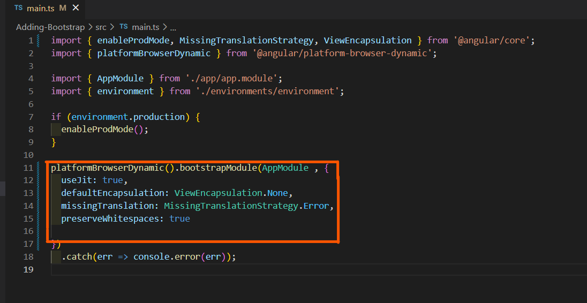
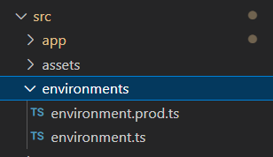
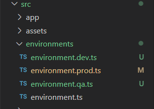
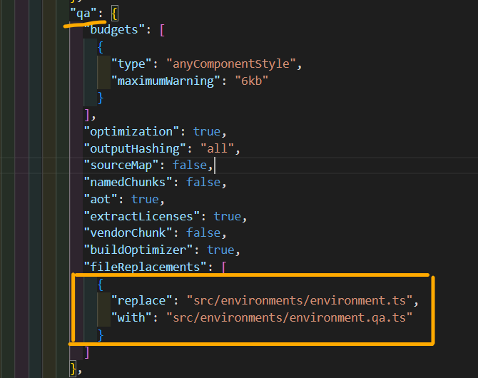
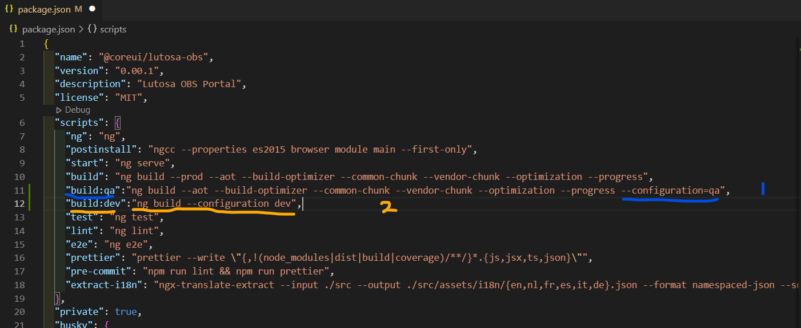

# Angular Concepts in an Real-time Application #

<br>

# Compiler Options #

<br>

* It is an optional Attribute in the `bootstrapModule` in `main.ts` file's `platformBrowserDynamic()` of an application .

* The `bootstrapModule` usually takes one default argument as `Module` which `AppModule` in most cases .

* The second argument is optional which is `compilerOptions` .

* This compilerOptions is an Object that have several use case and as key - value pairs .

* The usecases and types of that usecases are listed below as in the official documentation :

<br>

### compilerOptions ###

<br>

```javascript

type CompilerOptions = {
    useJit?: boolean;
    defaultEncapsulation?: ViewEncapsulation;
    providers?: StaticProvider[];
    missingTranslation?: MissingTranslationStrategy;
    preserveWhitespaces?: boolean;
};

```

## Applying the compilerOptions in the main.ts  ##

<br>



<br>

# Handling multiple environment files in angular application #

<br>

* Usually only two environment files will be found available in our angular application under the src folder in our application as below :

<br>



<br>

* These environment files can be changed when we build our application for deployment .

* We can find this replacement in the angular.json configurations.

<br>

### angular.json ###

<br>

```javascript
...
   "configurations": {
            "production": {
              "budgets": [
                {
                  "type": "anyComponentStyle",
                  "maximumWarning": "6kb"
                }
              ],
              "optimization": true,
              "outputHashing": "all",
              "sourceMap": false,
              "namedChunks": false,
              "aot": true,
              "extractLicenses": true,
              "vendorChunk": false,
              "buildOptimizer": true,
              "fileReplacements": [
                {
                  "replace": "src/environments/environment.ts",
                  "with": "src/environments/environment.prod.ts"
                }
              ]
            }
          }
...
```

* It is okay for the single environment file with on apiurl .

* We can manage multiple environment files with meaningful naming followed by environment word with .ts extension .

* Each one needs to replaced with the prod.ts during production . 

<br>

### Havng Multiple environment files in application ###

<br>



<br>

* We should add configurations for each environment files for the building process .

* Change the replacement section with new file we added with meaning full name :

* Example :

<br>



* Here , i have changed the filename with my alternative file and value name in the Keyword .

<br>

### angular.json : ###

<br>

```javascript
{
  "$schema": "./node_modules/@angular/cli/lib/config/schema.json",
  "version": 1,
  "newProjectRoot": "projects",
  "projects": {
    ....
    ...
    ...
          "configurations": {
            "production": {
              "budgets": [
                {
                  "type": "anyComponentStyle",
                  "maximumWarning": "6kb"
                }
              ],
              "optimization": true,
              "outputHashing": "all",
              "sourceMap": false,
              "namedChunks": false,
              "aot": true,
              "extractLicenses": true,
              "vendorChunk": false,
              "buildOptimizer": true,
              "fileReplacements": [
                {
                  "replace": "src/environments/environment.ts",
                  "with": "src/environments/environment.prod.ts"
                }
              ]
            },
            "qa": {
              "budgets": [
                {
                  "type": "anyComponentStyle",
                  "maximumWarning": "6kb"
                }
              ],
              "optimization": true,
              "outputHashing": "all",
              "sourceMap": false,
              "namedChunks": false,
              "aot": true,
              "extractLicenses": true,
              "vendorChunk": false,
              "buildOptimizer": true,
              "fileReplacements": [
                {
                  "replace": "src/environments/environment.ts",
                  "with": "src/environments/environment.qa.ts"
                }
              ]
            },
            "dev": {
              "budgets": [
                {
                  "type": "anyComponentStyle",
                  "maximumWarning": "6kb"
                }
              ],
              "optimization": true,
              "outputHashing": "all",
              "sourceMap": false,
              "namedChunks": false,
              "aot": true,
              "extractLicenses": true,
              "vendorChunk": false,
              "buildOptimizer": true,
              "fileReplacements": [
                {
                  "replace": "src/environments/environment.ts",
                  "with": "src/environments/environment.dev.ts"
                }
              ]
            }
          }
        },
        ...
        ...
        ...
}

```
<br>


# Building Application with multiple environment files with different apiUrl #

<br>

* For ordinary single environment file , we should use angular cli command `ng build` or `ng build --prod` to deploy or production mode .

* To change the environment while building our application , we should use `ng build --configuration <name>` ( As we given in anfula.json )

```javascript

ng build --configuration dev

OR

ng build --configuration qa

```

# Running with the server using npm run build command # 

<br>

* For deploying our application in the server  we cannot use the `ng` command as the server does only know the node and not angular cli .

* To achieve the deployment in server , we should run , `npm run build` or `npm run build --prod`.

* To use other environment files we should use `npm run build -- --c name` . Example :

<br>

```javascript
npm run build -- --c dev OR npm run build -- --c qa
```
<br>

# Fixing custom ( Own ) command to use while building the application #

<br>

* We can fix our own command as alternative to `npm run build:qa` or `npm run build:dev` . To do this , we should change the `package .json file` in `script` as below:

<br>



<br>

* As the image shows , we ca do it with two method :

  * First one is add --configurations=qa OR

  * Second one is Adding the exact build command as an argument to the name we want : `ng build --configuration dev`

<br>

# Prettier #

<br>

* Prettier is a package that formates our code in the application to avoid the extra spaces and so on .

* We can also use visual studio code tools exension to format our code . But , the other developer may not have that feature . So we must use the package to handle all the developers code in a unified way using prettier .

<br>

## Installing prettier in Angular Application ##

<br>


  


